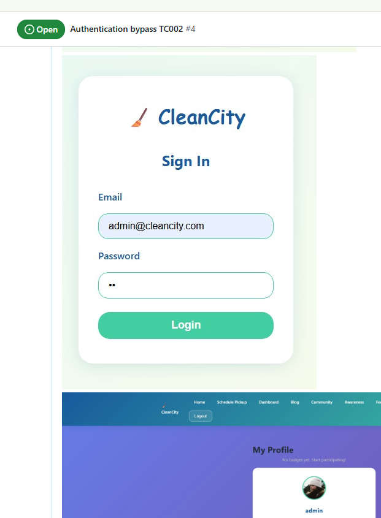
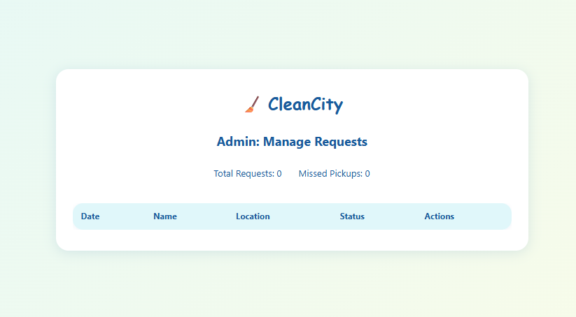
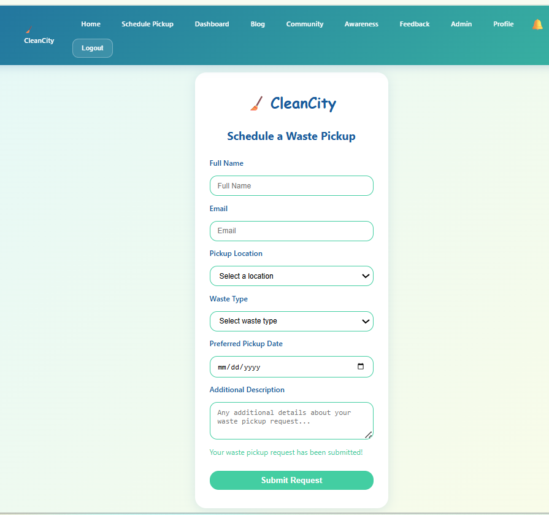
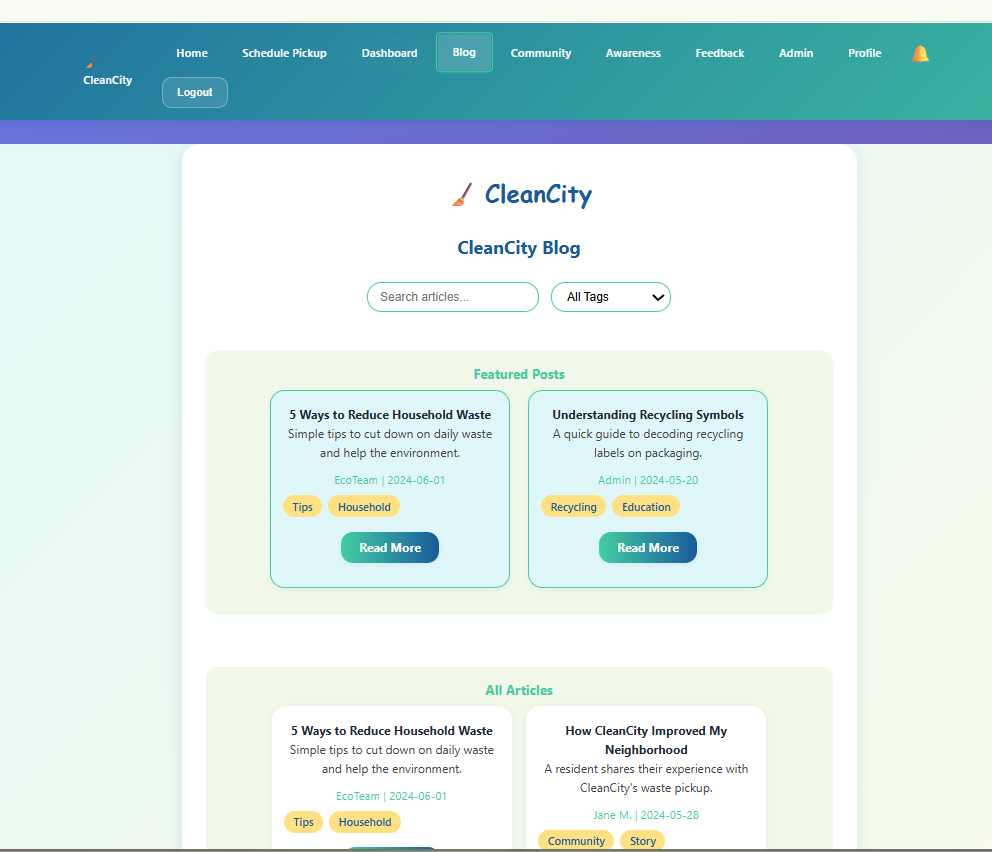
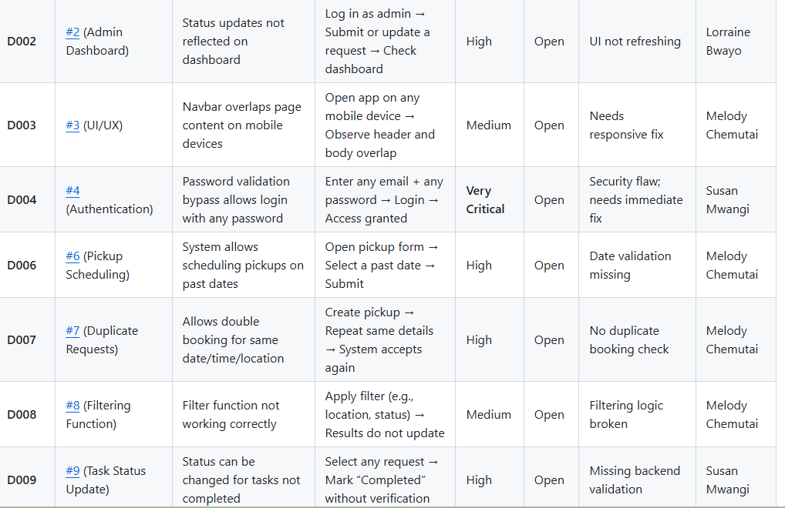

# **Final QA Test Report**

### **CleanCity – Waste Pickup Scheduler**

### **Prepared by: Test Case Trio (PLP Software Testing QA team)**

### **Date: November 18, 2025**

---

## 

---

# # **1. Cover Page**

### **Project Title:** CleanCity – Waste Pickup Scheduler

### **Course:** Software Testing

### **Institution:** Power Learn Project (PLP) Software Development

### **Team Name:** Test Case Trio

### **Document Version:** 1.0

### **Date:** November 18, 2025

> **Team Members**

* Mercy Melody Chemutai – Test Manager
* Lorraine Bwayo – Risk Analyst
* Susan Mwangi – Test Executor

---

# # **2. Table of Contents**

1. Document Information
2. Executive Summary
3. Test Objectives
4. Scope of Testing
5. Team & Roles
6. Test Environment
7. Test Items
8. Testing Types
9. Schedule (Phase 1–3)
10. Test Cases Summary
11. Defect Summary
12. Risk Assessment
13. Requirement Traceability Overview
14. Test Metrics
15. Entry & Exit Criteria
16. Assumptions & Dependencies
17. Limitations
18. Recommendations
19. Conclusion
20. Approval
21. Appendices

---

# # **3. Executive Summary**

The **CleanCity Waste Pickup Scheduler** is a front-end web application designed to help users schedule waste pickups, submit feedback, manage profiles, and interact with community features such as blogs. This report summarizes the **testing activities, findings, defects, risk analysis, and recommendations**.

### **Key Findings:**

* **Critical issues** exist in login, validation, admin functions, and dashboard synchronization.
* **High failure rate** in functional tests due to missing backend validation and poor UI input handling.
* UI is visually appealing but **not fully responsive** on smaller devices.
* Automated tests and unit tests partially cover components and forms.
* LocalStorage persistence works, but data integrity issues exist.

Overall, the application **meets basic functionality** but requires **major fixes** before production readiness.

---

# # **4. Test Objectives**

* Validate functionality, usability, and reliability of CleanCity.
* Ensure accurate waste scheduling, user authentication, and admin workflows.
* Verify responsiveness across devices and browsers.
* Identify and document defects.
* Validate input handling and localStorage data persistence.
* Establish baseline automated test coverage (Jest).

---

# # **5. Scope of Testing**

### **In Scope**

* User registration, login, logout
* Waste pickup scheduling
* Admin dashboard actions (view/update/filter)
* Blog features (view/edit/create/delete posts)
* Feedback submission
* localStorage persistence
* Responsiveness & UI consistency
* Early Jest-based testing

### **Out of Scope**

* Backend API/database integration
* Performance testing under heavy loads
* Third-party integrations
* Security penetration testing beyond validation/XSS checks

---

# # **6. Team and Roles**

| Role          | Member                | Responsibilities                      |
| ------------- | --------------------- | ------------------------------------- |
| Test Manager  | Mercy Melody Chemutai | Planning, coordination, documentation |
| Test Executor | Susan Mwangi          | Manual test execution, defect logging |
| Risk Analyst  | Lorraine Bwayo        | Risk evaluation, regression testing   |

---

# # **7. Test Environment**

| Component        | Details                                                                                            |
| ---------------- | -------------------------------------------------------------------------------------------------- |
| Application Type | Frontend Web Application                                                                           |
| Browsers         | Chrome, Firefox, Edge                                                                              |
| Data Storage     | localStorage                                                                                       |
| Devices          | Lenovo ThinkPad T490S, HP ZBook G6, HP Spectre, Nothing Phone 2a, Redmi Note 14, iPhone 12 Pro Max |
| OS               | Windows 10/11, Android 14, iOS 17                                                                  |
| Tools            | GitHub Kanban, Browser DevTools, Jest, Selenium, Chromedriver                                                             |

---

# # **8. Test Items**

* Registration / Login / Logout
* Waste Pickup Form
* Admin Panel
* Dashboard Filters & Status Updates
* Feedback Form
* Blog System (CRUD + comments + images)
* Notifications
* Profile Editing
* Accessibility
* Responsiveness

---

# # **9. Testing Types**

* Functional Testing
* UI/UX Testing
* Validation Testing
* Accessibility Testing
* Compatibility Testing
* Regression Testing
* Manual Exploratory Testing
* Automated Testing (Unit + Integration using Jest)

---

# # **10. Schedule (All Phases Completed)**

### **Phase 1 — Setup**

| Task           | Period  | Status |
| -------------- | ------- | ------ |
| Repo Setup     | Nov 3–4 | Done   |
| Test Plan Prep | Nov 4–5 | Done   |

### **Phase 2 — Test Design & Initial Execution**

| Task                 | Period   | Status |
| -------------------- | -------- | ------ |
| Test Case Drafting   | Nov 7–8  | Done   |
| Early Manual Testing | Nov 8–9  | Done   |
| Automated Testing    | Nov 8–10 | Done   |
| Defect Logging       | Nov 9–11 | Done   |

### **Phase 3 — Final Testing & Submission**

| Task                | Period    | Status    |
| ------------------- | --------- | --------- |
| RTM Compilation     | Nov 10–11 | Completed |
| Full Test Execution | Nov 10–15 | Completed |
| Regression Testing  | Nov 11–17 | Completed |
| Final Documentation | Nov 11–17 | Completed |
| Submission          | Nov 18    | Submitted |

---

# # **11. Test Case Summary**

A total of **130+ test cases** were designed covering:

✔ Authentication
✔ Waste Pickup
✔ Dashboard
✔ Admin Functions
✔ Blog Features
✔ User Settings
✔ Notifications
✔ Export & Analytics
✔ Responsive Layout
✔ Accessibility

**Execution Breakdown:**

* **Passed:** ~40
* **Failed:** ~60
* **Draft/Not Executed:** ~30

(Full test case sheet in Appendix A)

---

# # **12. Defect Summary**

A total of **50+ confirmed defects**, with severity breakdown:

| Severity      | Count | Examples                                  |
| ------------- | ----- | ----------------------------------------- |
| Very Critical | 3     | Login bypass, admin unrestricted access   |
| High          | 18    | Invalid scheduling, dashboard not syncing |
| Medium        | 20    | Form errors, missing input validation     |
| Low           | 10    | UI inconsistencies, minor UX bugs         |

(Full defect log in Appendix C)

---

# # **13. Risk Assessment**

### **High Risks**

* Missing backend validation
* Security loopholes
* Inconsistent data handling
* Responsiveness issues

### **Medium Risks**

* Incorrect form validations
* Duplicate data submissions

### **Low Risks**

* UI polishing
* Missing minor labels

(Full risk matrix included earlier)

---

# # **14. Requirement Traceability Overview**

All **88 requirements (R-001 to R-088)** were mapped to:

✔ Test Cases
✔ Execution Status
✔ Defects
✔ Risks

Full table is provided in **Appendix B**.

---

# # **15. Test Metrics**

### **Test Case Metrics**

| Metric   | Value |
| -------- | ----- |
| Total TC | 130+  |
| Executed | 100+  |
| Passed   | ~40   |
| Failed   | ~60   |

### **Defect Metrics**

| Severity | Count |
| -------- | ----- |
| Critical | 10+   |
| High     | 20+   |
| Medium   | 30+   |
| Low      | 15+   |

### **Coverage**

✔ 100% requirement coverage
✖ Only ~30% execution passed
✖ Multiple critical features not stable

---

# # **16. Entry Criteria**

Testing began after:

* Application rendered without runtime errors
* Test environment ready
* Test plan + data prepared
* GitHub Issues tracking enabled

---

# # **17. Exit Criteria**

Testing ended when:

* All priority test cases executed
* All critical issues logged
* Regression completed
* RTM validated
* Final report ready

---

# # **18. Assumptions & Dependencies**

* Application stays frontend-only.
* Developers fix issues in future iterations.
* No server/API layer exists.
* Test data is synthetic.

---

# # **19. Limitations**

* No real backend → limited validation.
* localStorage is volatile.
* Limited automation coverage.
* Real performance/load testing not possible.

---

# # **20. Recommendations**

1. Add backend with API validation.
2. Implement role-based permission guard.
3. Add proper form validation.
4. Improve responsiveness across devices.
5. Implement analytics dashboard correctly.
6. Ensure accessibility compliance (WCAG 2.1).

---

# # **21. Conclusion**

While CleanCity demonstrates strong potential as a community-driven waste management application, current implementation faces **major reliability, validation, and security issues**. With improvements in backend integration, form validation, admin logic, and UI responsiveness, it can reach production quality.

---

# # **22. Approval Section**

| Name                      | Role          | Signature | Date       |
| ------------------------- | ------------- | --------- | ---------- |
| **Mercy Melody Chemutai** | Test Manager  |           | 18/11/2025 |
| **Lorraine Bwayo**        | Risk Analyst  |           | 18/11/2025 |
| **Susan Mwangi**          | Test Executor |           | 18/11/2025 |
| **Instructor / QA Lead**  | Reviewer      |           | 18/11/2025 |

---

# # **23. Appendices**

### **Appendix A: Full Test Cases**

> [Open Test Cases](./test-cases.md)

### **Appendix B: Requirements Traceability Matrix**

> [Open Requirements Traceability Table](./requirements-traceability.md)

### **Appendix C: Defect Log**

> [Open Defect Log](./defect-log.md)

### **Appendix D: Challenges.md
[Open Challenges Document](./challenges.md)

###  Appendix F: PDF Version of Report  
[CleanCity Test Report (PDF)] (./TestCaseTrio_CleanCity_QA_Report_18 Nov.pdf)
###  Appendix G: Screenshots**

> 
> 
> 
> 
> 

---

# # **24. PLP Logo**

> 

